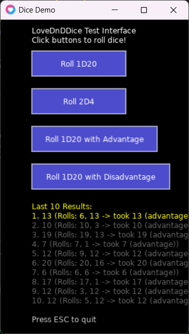

# LoveDnDDice

A lightweight dice rolling library for Love2D, perfect for tabletop RPGs, roguelikes, board games, and any project that needs dice mechanics. Supports standard dice notation with modifiers.



## Import into Project

You can either copy the `Dice.lua` file directly into your Love2D project or use this repo as a git submodule.

### Use as a Git Submodule

1. `git submodule add https://github.com/Saturn91/LoveDnDDice.git libs/LoveDnDDice`
2. In order to allow relative imports, use this handy code:

```lua
local packages = {
  "libs/LoveDnDDice/?.lua",
}

local current = love.filesystem.getRequirePath and love.filesystem.getRequirePath() or "?.lua;"
love.filesystem.setRequirePath(table.concat(packages, ";") .. ";" .. current)
```

### Setting Up the Require Path

To use the submodule in your Love2D project, add the require path setup code to the top of your `main.lua` file (before any `require()` calls that use the submodule):

```lua
-- Set up require path for the LoveDnDDice submodule
local packages = {
  "libs/LoveDnDDice/?.lua",
}

local current = love.filesystem.getRequirePath and love.filesystem.getRequirePath() or "?.lua;"
love.filesystem.setRequirePath(table.concat(packages, ";") .. ";" .. current)

-- Now you can require the dice module
local Dice = require("Dice")
```

This tells Love2D's filesystem to look for modules in the `libs/LoveDnDDice/` folder. After this setup, you can use the library as shown in the Usage section.

## Features

- **Standard dice notation** support (XdY, dY, XdY±Z)
- **Modifier support** for adding/subtracting constants
- **Formula validation** to ensure correct dice syntax
- **Random rolling** using Love2D's math.random
- **Flexible parsing** handles spaces and various formats
- **Error handling** with optional logging support
- **Lightweight** single-file implementation

## Getting Started

### Prerequisites

- [Love2D](https://love2d.org/) (LÖVE) game framework

### Installation

1. Clone this repository:
```bash
git clone https://github.com/yourusername/LoveDnDDice.git
cd LoveDnDDice
```

2. Run the demo:
```bash
love .
```

The demo includes a simple GUI with buttons to test different dice rolls including advantage mechanics.

## Usage

### Basic Setup

```lua
local Dice = require("Dice")

function love.load()
    -- Roll a single d20
    local result = Dice.roll("d20")
    print("Rolled a d20: " .. result)

    -- Roll 2d6 + 3
    local attackRoll = Dice.roll("2d6+3")
    print("Attack roll: " .. attackRoll)
end
```

### Dice Formulas

The library supports standard tabletop RPG dice notation:

```lua
-- Single die
Dice.roll("d6")      -- Roll one 6-sided die
Dice.roll("d20")     -- Roll one 20-sided die

-- Multiple dice
Dice.roll("2d6")     -- Roll two 6-sided dice
Dice.roll("3d8")     -- Roll three 8-sided dice

-- With modifiers
Dice.roll("2d6+3")   -- Roll 2d6 and add 3
Dice.roll("d12-1")   -- Roll d12 and subtract 1
Dice.roll("4d10+5")  -- Roll 4d10 and add 5

-- Spaces are allowed
Dice.roll("2d6 + 3") -- Same as "2d6+3"
```

### Advantage and Disadvantage

For D&D-style advantage/disadvantage mechanics (typically used with d20 rolls):

```lua
-- Advantage: roll twice, take higher
local attackRoll = Dice.roll("d20", {advantage = true})

-- Disadvantage: roll twice, take lower  
local stealthCheck = Dice.roll("d20", {disadvantage = true})

-- Both flags cancel each other out (normal roll)
local normalRoll = Dice.roll("d20", {advantage = true, disadvantage = true})
```

### Validation

Before rolling, you can validate dice formulas:

```lua
if Dice.validateFormula("2d6+3") then
    local result = Dice.roll("2d6+3")
    print("Valid roll: " .. result)
else
    print("Invalid dice formula")
end
```

### Advanced Usage

```lua
-- Parse formula components
local diceSize, numDice, modifier = Dice.getDicesFromFormula("2d6+3")
print(string.format("Rolling %dd%d%+d", numDice, diceSize, modifier))

-- Batch rolling for statistics
local results = {}
for i = 1, 100 do
    results[i] = Dice.roll("d20")
end

-- Calculate averages or other statistics
local sum = 0
for _, result in ipairs(results) do
    sum = sum + result
end
print("Average d20 roll: " .. (sum / #results))
```

## Demo

The included demo (`main.lua`) provides a simple graphical interface for testing dice rolls. It includes buttons for:

- **1D20**: Standard d20 roll
- **2D4**: Roll two 4-sided dice  
- **1D20 with Advantage**: Shows both rolls and which one was selected
- **1D20 with Disadvantage**: Shows both rolls and which one was selected

The interface displays a history of the last 10 dice rolls, showing both the final result and detailed breakdown for advantage/disadvantage rolls.

Click the buttons to roll dice and see the results displayed on screen. For advantage rolls, it shows the individual dice results and indicates which one was chosen.

Run it with:
```bash
love .
```

Press ESC to quit the demo.

## API Reference

### Dice.roll(diceFormula, options)

Rolls dice according to the given formula.

**Parameters:**
- `diceFormula` (string): Dice formula in format "XdY" or "XdY±Z"
- `options` (table, optional): Options table with:
  - `advantage` (boolean): If true, rolls twice and takes the higher result
  - `disadvantage` (boolean): If true, rolls twice and takes the lower result
  - If both are true, they cancel out (normal roll)

**Returns:**
- `number`: The total result of the roll (minimum 1)

**Examples:**
```lua
local result = Dice.roll("2d6+3")  -- Returns number between 5-15
local attack = Dice.roll("d20", {advantage = true})  -- 2d20, take higher
local save = Dice.roll("d20", {disadvantage = true})  -- 2d20, take lower
```

### Dice.validateFormula(diceFormula)

Validates whether a dice formula is correctly formatted.

**Parameters:**
- `diceFormula` (string): The formula to validate

**Returns:**
- `boolean`: True if valid, false otherwise

**Example:**
```lua
if Dice.validateFormula("d20") then
    print("Valid!")
end
```

### Dice.getDicesFromFormula(diceFormula)

Parses a dice formula into its components.

**Parameters:**
- `diceFormula` (string): The formula to parse

**Returns:**
- `diceSize` (number): Size of each die
- `numDice` (number): Number of dice to roll
- `modifier` (number): Constant modifier (±0 if none)

**Example:**
```lua
local size, count, mod = Dice.getDicesFromFormula("2d6+3")
-- size = 6, count = 2, mod = 3
```

## File Structure

```
LoveDnDDice/
├── main.lua          # Demo application
├── Dice.lua          # Core dice rolling library
├── conf.lua          # Love2D configuration
└── README.md         # This file
```

## Integration into Your Project

### Option 1: Copy the File
Simply copy `Dice.lua` to your project and require it:

```lua
local Dice = require("Dice")
```

### Option 2: Git Submodule
Add as a git submodule:

```bash
git submodule add https://github.com/yourusername/LoveDnDDice.git lib/Dice
```

### Option 3: Direct Integration
For minimal projects, you can copy the Dice table directly into your code:

```lua
local Dice = {
    -- Copy the entire Dice.lua content here
}
```

## Example Projects

This library is perfect for creating:

- **Tabletop RPGs** (D&D, Pathfinder, etc.)
- **Board games** with dice mechanics
- **Roguelikes** and dungeon crawlers
- **Card games** with dice-based resolution
- **Gambling simulators**
- **Educational math tools**
- **Dice probability calculators**

## Contributing

1. Fork the repository
2. Create a feature branch
3. Make your changes
4. Add tests if applicable
5. Submit a pull request

## License

This project is licensed under the MIT License - see the LICENSE file for details.

## Acknowledgments

- Built with [Love2D](https://love2d.org/)
- Inspired by tabletop gaming and RPG systems
- Uses Love2D's built-in random number generation